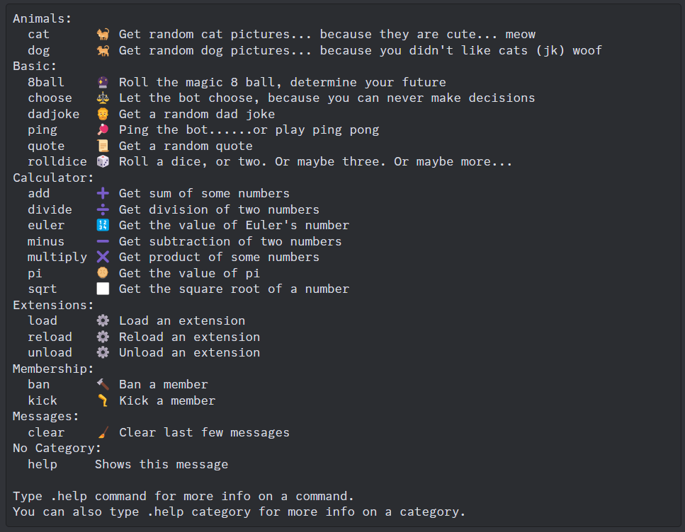

# About


This is melvybot. (Please help me come up with a better name)

He is a Discord bot coded in Python using the discord.py library.

He does very random things. He can make a choice for you. He can do simple calculations. He can help moderate servers. He can tell a dad joke.

But most importantly, he can send you pictures of meow meows and doggos.

**Call the bot by using the prefix: ```.``` or by mentioning ```@melvybot``` before typing the command.**

I'm too lazy to list every command so here is a picture of the help command:



There isn't very much things melvybot can do now, but he will be able to do so much more in the future!

Here are some future planned features to add:

- Getting Pokémon stats (like a Pokédex)
- Playing music in a voice channel
- More moderation commands
- Chat with AI (with Google Gemini AI)
- and more...
